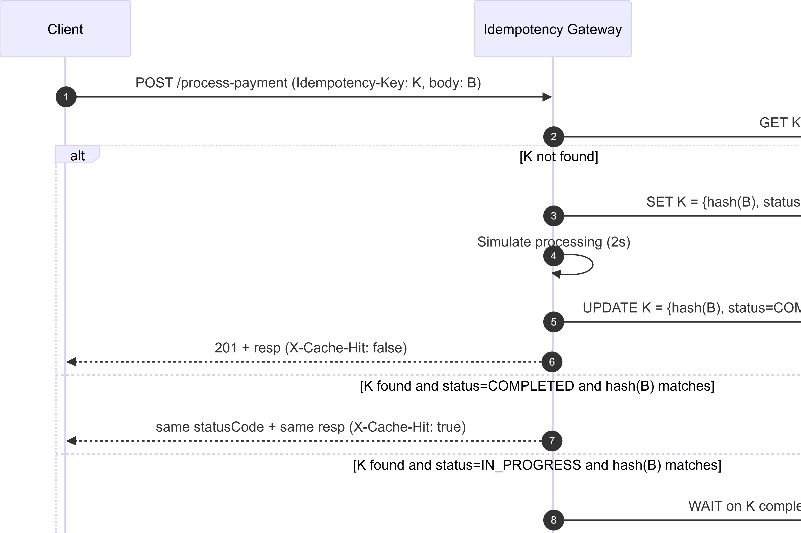
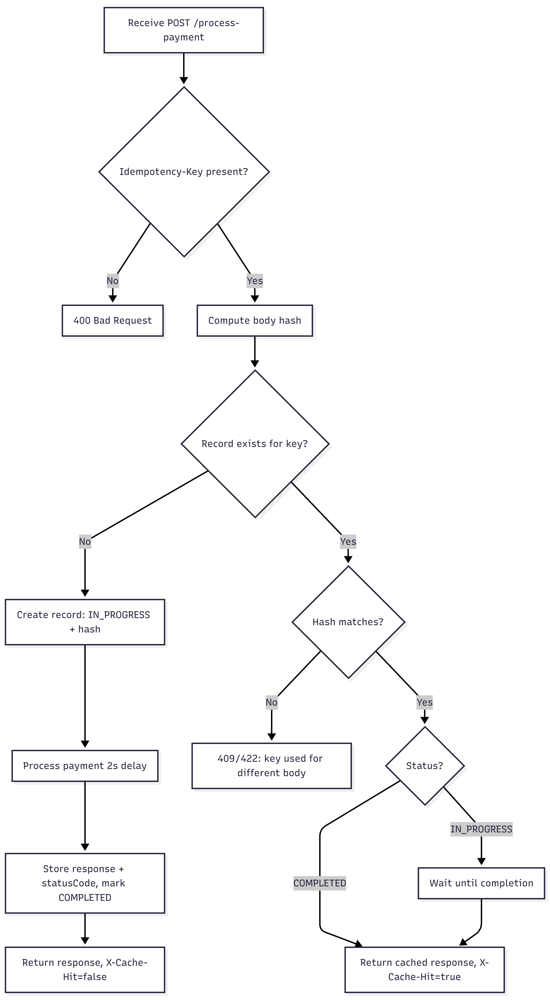

# Idempotency Gateway (Pay-Once Protocol)

## Overview

This project implements an **Idempotency Gateway**, a middleware layer that ensures payment requests are processed **exactly once**, even if clients retry due to network failures or timeouts.

This system mimics a real-world payment processor backend and prevents **double charging**, a critical requirement for fintech reliability, customer trust, and regulatory compliance.

The gateway uses an **Idempotency-Key** to uniquely identify requests and safely replay responses when duplicate requests occur.

---

## Architecture Diagram


### Sequence Diagram



---

## Tech Stack

* Node.js
* Express.js
* TypeScript
* In-Memory Idempotency Store
* Pino Logger (Structured Logging)

---

## Setup Instructions

### 1. Clone your fork

```bash
git clone https://github.com/theniitettey/idempotency-gateway.git
cd idempotency-gateway
```

### 2. Install dependencies

```bash
npm install
```

### 3. Run development server

```bash
npm run dev
```

### 4. Run production build

```bash
npm run build
npm start
```

Server runs at:

```
http://localhost:3000
```

---

## API Documentation

### Endpoint

```
POST /process-payment
```

---

### Headers (Required)

```
Idempotency-Key: <unique-string>
Content-Type: application/json
```

---

### Request Body

```json
{
  "amount": 100,
  "currency": "GHS"
}
```

---

## Responses

### First Request (Processed Normally)

**Status**

```
201 Created
```

**Headers**

```
X-Cache-Hit: false
```

**Body**

```json
{
  "message": "Charged 100 GHS"
}
```

Processing includes a simulated 2-second delay.

---

### Duplicate Request (Replay)

**Status**

```
201 Created
```

**Headers**

```
X-Cache-Hit: true
```

**Body**

```json
{
  "message": "Charged 100 GHS"
}
```

Returned instantly without reprocessing.

---

### Same Key, Different Request Body

**Status**

```
409 Conflict
```

**Body**

```json
{
  "error": "Idempotency key already used for a different request body."
}
```

This prevents fraud or data corruption.

---

## Example Requests

### First Payment

```bash
curl -X POST http://localhost:3000/process-payment \
  -H "Content-Type: application/json" \
  -H "Idempotency-Key: payment-123" \
  -d '{"amount":100,"currency":"GHS"}'
```

---

### Duplicate Payment

```bash
curl -X POST http://localhost:3000/process-payment \
  -H "Content-Type: application/json" \
  -H "Idempotency-Key: payment-123" \
  -d '{"amount":100,"currency":"GHS"}'
```

---

### Invalid Reuse of Key

```bash
curl -X POST http://localhost:3000/process-payment \
  -H "Content-Type: application/json" \
  -H "Idempotency-Key: payment-123" \
  -d '{"amount":500,"currency":"GHS"}'
```

---

## Design Decisions

### 1. Idempotency Key Store

Each key stores:

* Request hash (SHA-256)
* Processing status (IN_PROGRESS or COMPLETED)
* Cached response
* Promise reference for in-flight requests
* Expiration timestamp

This enables:

* Safe replay
* Race condition protection
* Fraud prevention

---

### 2. Request Fingerprinting (Canonical JSON + Hash)

Requests are normalized using canonical JSON before hashing to ensure logically identical requests produce identical hashes regardless of field order.

Example:

```json
{ "amount": 100, "currency": "GHS" }
```

and

```json
{ "currency": "GHS", "amount": 100 }
```

produce the same hash.

This prevents duplicate charges.

---

### 3. In-Flight Request Handling (Race Condition Protection)

If two requests with the same key arrive simultaneously:

* First request begins processing
* Second request waits
* Second request receives cached result

This prevents concurrent duplicate processing.

---

### 4. Structured Logging

The system uses Pino logger to record:

* Payment processing events
* Duplicate requests
* Errors
* Processing duration

This improves observability and debugging.

---

## Developer’s Choice Feature: TTL Expiration and Automatic Cleanup

### Feature

Each idempotency key expires after 24 hours.

Expired keys are automatically removed by a background cleanup process.

### Implementation

Each record contains:

```
expiresAt timestamp
```

A cleanup process runs every 60 seconds:

```
setInterval(() => cleanupExpiredKeys(), 60000)
```

---

### Why This Is Important

In real fintech systems, idempotency keys should not exist forever because:

* Prevents unlimited memory growth
* Reduces stale replay risks
* Matches real retry behavior (clients retry within minutes or hours)

This improves system scalability and safety.

---

## Project Structure

```
src/
  config/
    index.ts
  controllers/
    index.ts
    payment.controller.ts
  interfaces/
    index.ts
  middlewares/
    cors.middleware.ts
    errorHandler.middleware.ts
    idempotency.middleware.ts
    index.ts
    logger.middleware.ts
  routes/
    index.ts
    payment.route.ts
  services/
    idempotencyStore.service.ts
    index.ts
    payment.service.ts
  tests/
    testIdempotency.ts
  utils/
    hash.ts
    index.ts
    logger.ts
    normalizeResponses.ts
  index.ts
  server.ts
```

---

## Acceptance Criteria Coverage

| Requirement                  | Status   |
| ---------------------------- | -------- |
| Process payment              | Complete |
| Replay duplicate requests    | Complete |
| Prevent different-body reuse | Complete |
| Race condition protection    | Complete |
| Architecture diagram         | Complete |
| Documentation                | Complete |
| Developer feature            | Complete |

---

## Future Improvements

* Redis backend for distributed systems
* Persistent database storage
* Request rate limiting
* Payment reconciliation support
* Audit trail storage

---

## Author

Michael Perry Tettey

---

## License

MIT
